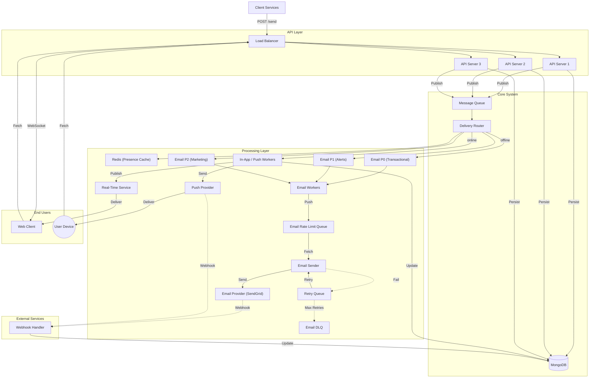

# System Architecture: High-Throughput Notification System

## Problem Statement
Architect a backend for a notification system serving React Native and React Web clients. It must handle high write throughput, decouple slow external providers (Email/Push), support real-time web updates, and manage offline mobile users.

---

## 1. Architecture Diagram

## 2. Addressing Constraints & Requirements

### 1. "Sending notifications is slow and unreliable"  
**Solution: Async Queue & Worker Pattern**

- The API persists the notification and publishes it to a Message Queue.
- Workers asynchronously process delivery, so the API never blocks.
- Retry queues handle transient failures; DLQ captures permanent failures.

This ensures low latency, fault tolerance, and isolation from provider outages.

---

### 2. "Real-time updates are required for the Web client"  
**Solution: Dedicated Real-Time Service**

- A WebSocket-based Real-Time Service maintains live connections.
- When the In-App worker processes a notification, it publishes it to the RT service.
- If the user is offline, the notification remains stored and is fetched later.

---

### 3. "Mobile apps rely on Push when closed"  
**Solution: Push Provider Integration**

- In-App / Push workers send push notifications via FCM/APNS.
- The OS handles background delivery when the device becomes reachable.

---

### 4. "Gracefully handle offline users"  
**Solution: Presence-Aware Routing via Redis**

- Redis tracks user presence (`online` / `offline`) using TTL-based keys.
- Router chooses the delivery channel:
  - **Online** → In-App / Push  
  - **Offline** → Email  

This avoids unnecessary emails and improves user experience.

---

### 5. "The system must scale to handle traffic spikes"  
**Solution: Horizontal Scaling & Buffering**

- The Message Queue buffers traffic bursts.
- Stateless APIs and workers scale horizontally.
- Auto-scaling can be driven by queue depth.

---

### 6. "Prevent provider overload and respect rate limits"  
**Solution: Rate-Limited Sender Queues**

- Workers push messages into a provider-specific rate-limit queue.
- Sender services drain these queues at safe rates, protecting API quotas.

---

### 7. Handle Different Business Priorities  
**Solution: Priority Queues**

The system classifies notifications based on business importance and processes them using priority queues to ensure critical messages are delivered first.

| Type           | Priority | Queue Level |
|----------------|----------|-------------|
| Transactional  | P0       | Highest     |
| Alerts         | P1       | Medium      |
| Marketing      | P2       | Lowest      |

Email workers always consume higher-priority queues before lower-priority ones, ensuring that important notifications are never delayed by non-critical traffic.
