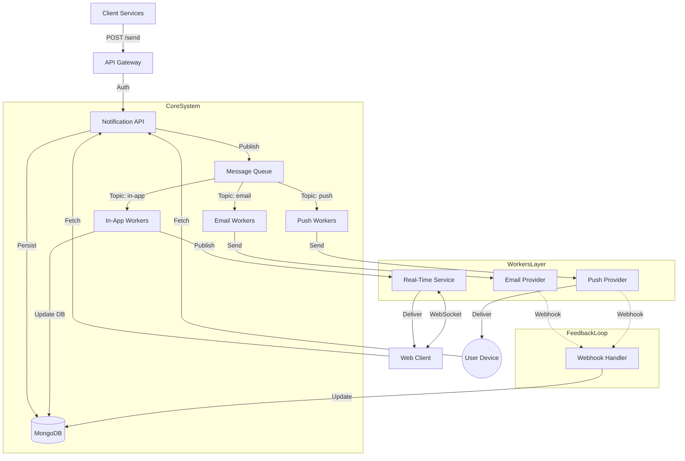

# System Architecture: High-Throughput Notification System

## Problem Statement
Architect a backend for a notification system serving React Native and React Web clients. It must handle high write throughput, decouple slow external providers (Email/Push), support real-time web updates, and manage offline mobile users.

## 1. Architecture Diagram

## 2. Addressing Constraints & Requirements

### 1. "Sending notifications is slow and unreliable"
**Solution: Async Queue & Worker Pattern**
-   **Non-blocking API**: The Main API receives the request, validates it, persists it as `pending` in MongoDB, and acknowledges the client immediately (`202 Accepted`).
-   **Decoupling**: The actual sending happens asynchronously via the **Message Queue**.
-   **Worker Isolation**: Separate worker pools for Email and Push ensure that if SendGrid provider is slow, it doesn't backlog the Push notifications.

### 2. "Real-time updates are required for the Web client"
**Solution: accessible Real-Time Service (WebSocket/SSE)**
-   **Dedicated Service**: A lightweight NodeJS/Go service maintains per-user WebSocket connections.
-   **Event-Driven**: When the `In-App Worker` processes a notification, it publishes a redis-sub event. The Real-Time Service subscribes to this node and immediately pushes the payload to the connected Web Client.
-   **Fallback**: If the user is not connected (offline), the notification remains in MongoDB. The next time the user loads the page, they fetch unread items from the API.

### 3. "Mobile apps rely on Push when closed"
**Solution: Dual-Channel Delivery**
-   **Push Channel**: The `Push Worker` specifically targets mobile device tokens (FCM/APNS). This channel operates independently of the real-time channel.
-   **Offline Handling**: Push notifications are natively designed for offline/background delivery by the OS. The server sends the payload to FCM, and FCM delivers it when the device is reachable.

### 4. "The system must scale to handle traffic spikes"
**Solution: Horizontal Scaling & Buffering**
-   **mq Buffering**: The Message Queue acts as a shock absorber. A spike of 10k req/sec is safely queued, even if workers can only process 5k/sec. The queue grows, but the system doesn't crash.
-   **Auto-scaling Workers**: We can autoscale the number of Worker instances based on queue lag (e.g., if queue > 1000, add 5 workers).
-   **Stateless Services**: The API and Workers are stateless, allowing infinite horizontal scaling behind a Load Balancer.

## 3. Data Flow Summary
1.  **Ingestion**: API accepts request -> Save to DB -> Push to Queue.
2.  **Processing**: Workers pull from Queue.
    -   **Push**: Format -> Send to FCM.
    -   **Email**: Format -> Send to SendGrid.
    -   **In-App**: Update DB -> Publish to Real-Time Service.
3.  **Delivery**:
    -   **Mobile**: Receive FCM Push.
    -   **Web**: Receive WebSocket event (if online) or View Notification Bell (if offline).
